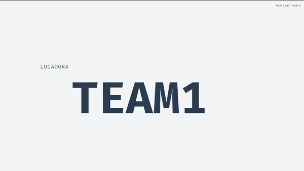
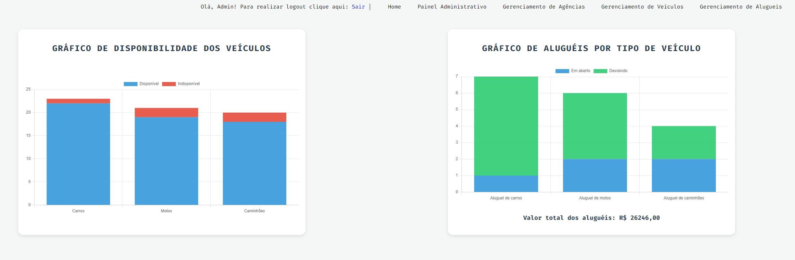
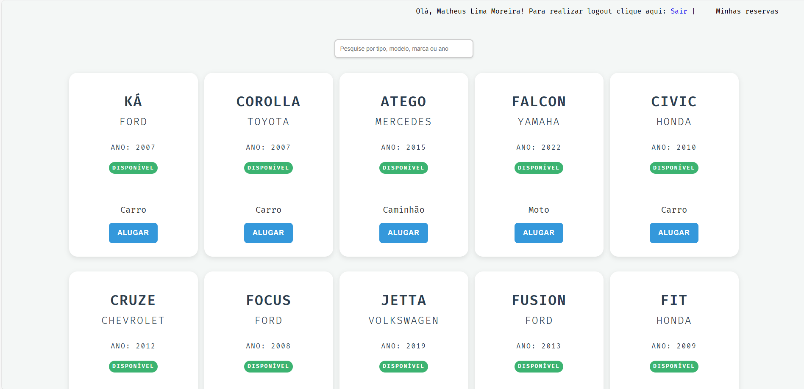
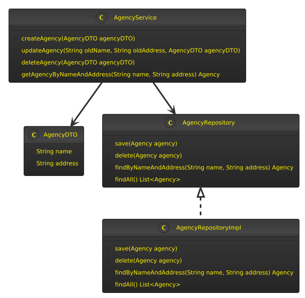
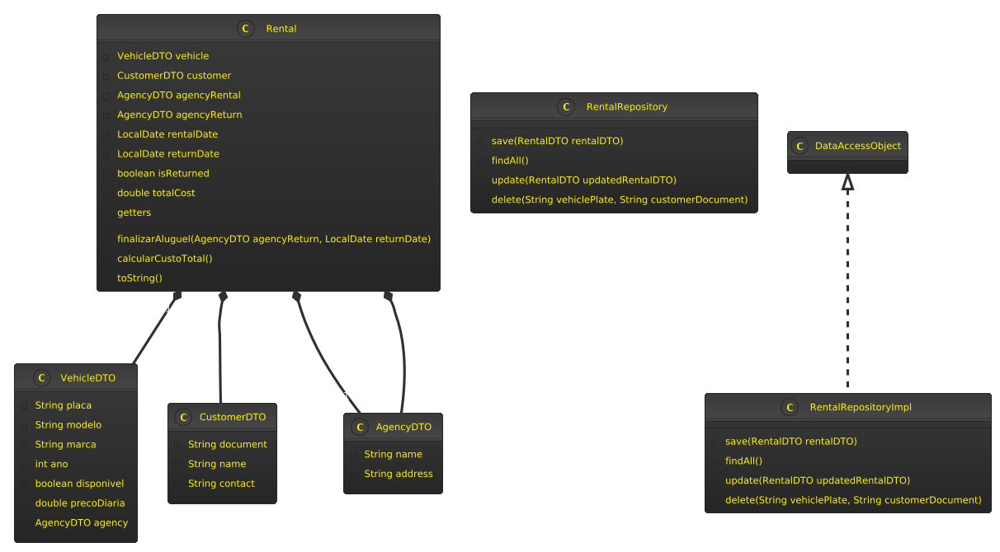
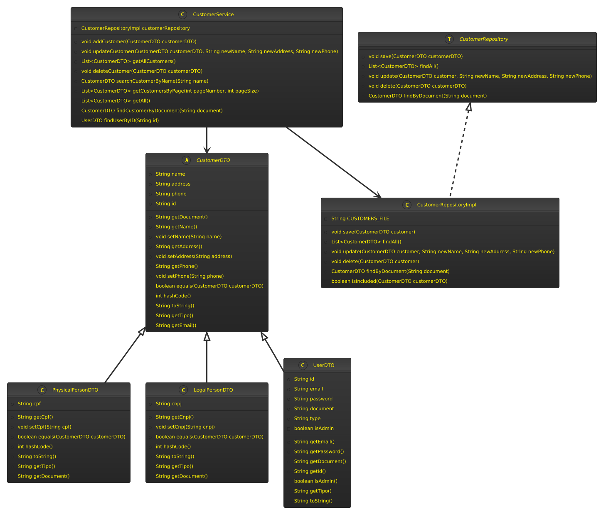
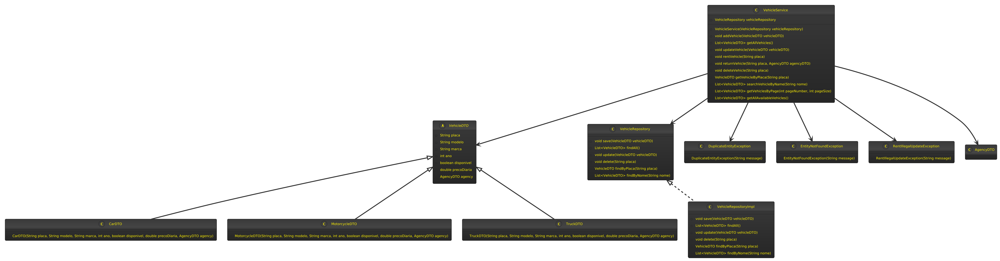

<div style="align-items: center; justify-content: center; display: flex">
  
</div>

---

# Locadora Team One 🚗

<div style="align-items: center; justify-content: center; display: flex" >
  
</div>

## Descrição
"Locadora Team One" é um projeto de locadora de veículos que oferece uma interface web para gerenciamento de veículos, usuários e agências. O projeto foi desenvolvido inteiramente em Java, sem a utilização de bibliotecas externas ou frameworks, utilizando uma API RESTful para a comunicação entre o cliente e o servidor.

## Tecnologias Usadas
- **Java**: Linguagem de programação principal utilizada para desenvolver a lógica do sistema.
- **OTP**: Técnica utilizada para garantir a segurança e autenticidade das transações.
- **API RESTful**: Estrutura utilizada para a comunicação entre o cliente e o servidor, permitindo operações CRUD (Criar, Ler, Atualizar, Deletar).

## Instalação
### Pré-requisitos
- Java Development Kit (JDK) instalado.
- IDE (como IntelliJ IDEA) configurada para desenvolvimento em Java.

### Passos para Instalação
1. Clone o repositório do projeto:
   ```bash
   git clone <URL do repositório>
   cd locadora-team-one
   ```
2. Abra o projeto na sua IDE preferida.
3. Compile o projeto e execute o servidor.

*Nota: Instruções detalhadas sobre a instalação serão adicionadas posteriormente.*

## Uso
A aplicação permite o gerenciamento de veículos, usuários e agências. As seguintes funcionalidades estão disponíveis:

- **Gerenciamento de Veículos**:
    - Cadastro, edição e remoção de veículos.
    - Consulta de veículos disponíveis.

- **Gerenciamento de Agências**:
    - Cadastro, edição e remoção de agências.
    - Consulta de agências disponíveis.

- **Autenticação de Usuários**:
    - Usuários podem se registrar e fazer login.
    - A autenticação é realizada via cookies, permitindo acesso às funcionalidades restritas.

- **Reserva de Veículos**:
    - Usuários autenticados podem realizar reservas de veículos.
    - O sistema emite recibos de aluguel em PDF e os envia por e-mail.


### Admin page

**A interface permite a visualização da quantidade de veículos, quantidade de aluguel por veículos e a situação deles
para ter um panorama geral dos dados:**


### User page

**A interface mostra os veículos disponíveis para aluguel para o usuário, permitindo que ele alugue diretamente clicando no veículo:**


### Endpoints da API
- **/agencies**: Consultar agências disponíveis.
- **/vehicles**: Consultar veículos disponíveis.
- **/rentals**: Realizar reservas e consultas de aluguel.

## Funcionalidades
- Cadastro e gerenciamento de veículos e agências.
- Autenticação de usuários com diferenciação entre administradores e usuários normais.
- Persistência de dados.
- Gráficos para melhor visualização de dados.
- Emissão de recibos de aluguel em PDF.
- Envio de recibos por e-mail com dados sobre a reserva.

## Estrutura do Projeto
O projeto é estruturado nas seguintes pastas principais:
- **src/main/java/com/team1**: Contém o código-fonte da aplicação.
    - **DTO**: Data Transfer Objects utilizados para transferir dados entre camadas.
    - **Repository**: Interfaces e implementações para acesso a dados.
    - **Service**: Classes de serviço que contêm a lógica de negócio.
    - **Server**: Classes responsáveis pela manipulação das requisições HTTP.

## Diagramas de Classes

**Todos diagramas de classe estão diponíveis na pasta [Diagrams](/infos/diagrams) no formato .puml**
### Diagrama da Classe Agency

### Diagrama da Classe Rental

### Diagrama da Classe Customer

### Diagrama da Classe Vehicle

## Licença
Este projeto é licenciado sob a [MIT License](LICENSE).