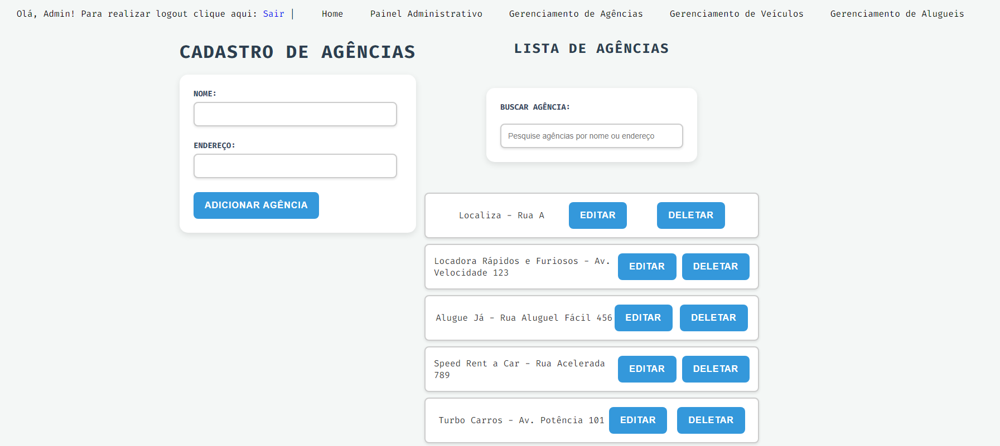
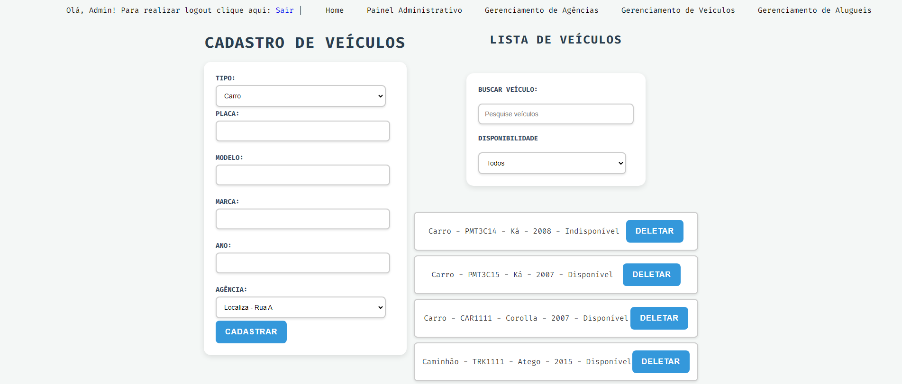
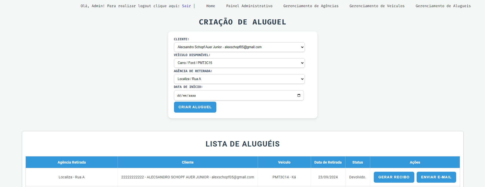
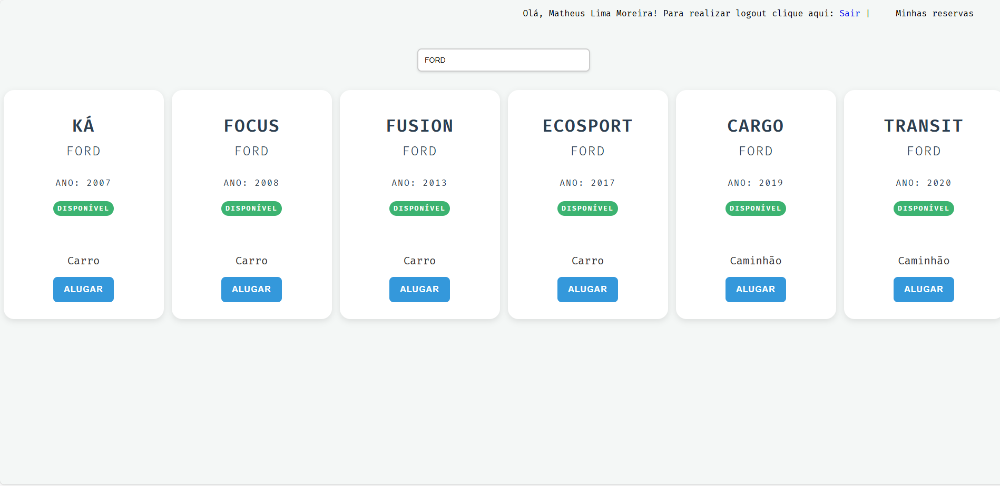
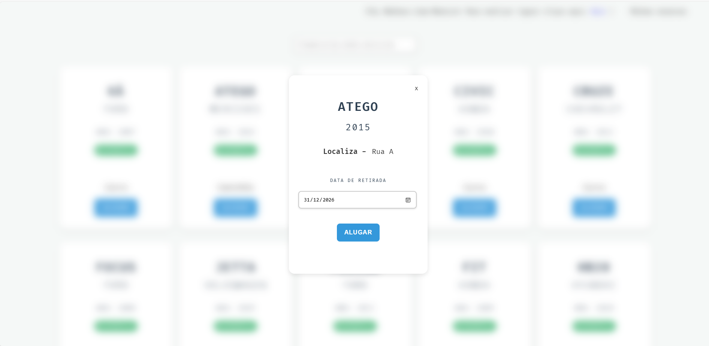
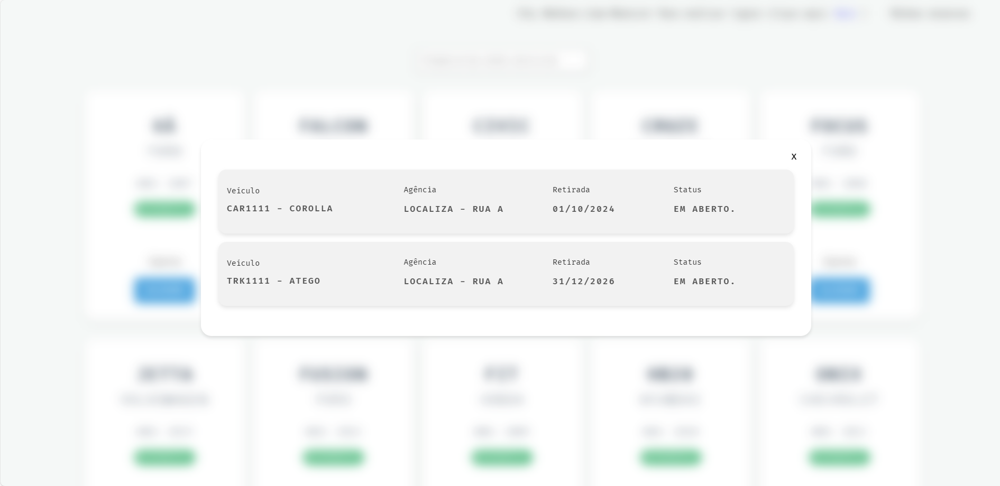

<p align="center">
  
</p>

# Locadora Team One 🚗

<p align="center">
  
</p>

## Descrição
"Locadora Team One" é um projeto de locadora de veículos que oferece uma interface web para gerenciamento de veículos, usuários e agências. O projeto foi desenvolvido inteiramente em Java, sem a utilização de bibliotecas externas ou frameworks, utilizando uma API RESTful para a comunicação entre o cliente e o servidor.

## Tecnologias Usadas
- **Java**: Linguagem de programação principal utilizada para desenvolver a lógica do sistema.
- **OTP**: Técnica utilizada para garantir a segurança e autenticidade das transações.
- **API RESTful**: Estrutura utilizada para a comunicação entre o cliente e o servidor, permitindo operações CRUD (Criar, Ler, Atualizar, Deletar).

## Regras de negócio do projeto

- **RN1:** Os veículos não podem ser repetidos (Placa é o delimitador);
- **RN2:** Tipos de veículos que serão considerados: Carro, Moto, Caminhões;
- **RN3:** Os aluguéis e devoluções terão o local e data;
- **RN4:** Os veículos que estiverem alugados não poderão estar disponíveis;
- **RN5:** Agências não podem estar duplicadas (Nome e endereço serão os delimitadores);
- **RN6:** Clientes não podem estar duplicados (Documento é o delimitador);
- **RN7:** Regras de devolução:
  - Caso pessoa fisica tenha ficado com o carro mais que 5 dias terá direito a 5% de desconto.
  - Caso pessoa juridica tenha ficado com o carro mais que 3 dias terá direito a 10% de desconto.

## Instalação
### Pré-requisitos
- Java Development Kit (JDK) instalado.
- IDE (como IntelliJ IDEA) configurada para desenvolvimento em Java.

### Passos para Instalação
1. Clone o repositório do projeto:
   ```bash
   git clone https://github.com/Team-1-Santander-Coders/LocadoraTeam1
   ```
2. Abra o projeto na sua IDE preferida.
3. Compile o projeto e execute o servidor.

*Nota: Instruções detalhadas sobre a instalação serão adicionadas posteriormente.*

## Uso
A aplicação permite o gerenciamento de veículos, usuários e agências. As seguintes funcionalidades estão disponíveis:

- **Gerenciamento de Veículos**:
    - Cadastro, edição e remoção de veículos.
    - Consulta de veículos disponíveis.

- **Gerenciamento de Agências**:
    - Cadastro, edição e remoção de agências.
    - Consulta de agências disponíveis.

- **Autenticação de Usuários**:
    - Usuários podem se registrar e fazer login.
    - A autenticação é realizada via cookies, permitindo acesso às funcionalidades restritas.

- **Reserva de Veículos**:
    - Usuários autenticados podem realizar reservas de veículos.
    - O sistema emite recibos de aluguel em PDF e os envia por e-mail.


### Admin page

**A home possui uma interface permite a visualização da quantidade de veículos, quantidade de aluguel por veículos e a situação deles
para ter um panorama geral dos dados:**


**Interface de administração de Agências:**


**Interface de administração de Veículos:**


**Interface de administração de Veículos:**


### User page

**A interface mostra os veículos disponíveis para aluguel para o usuário, permitindo que ele alugue diretamente clicando no veículo:**


**Opção de filtrar por veículos:**


**Interace de aluguel:**


**Lista de alugueis dos clientes:**


### Endpoints da API
- **/agencies**: Consultar agências disponíveis.
- **/vehicles**: Consultar veículos disponíveis.
- **/rentals**: Realizar reservas e consultas de aluguel.

Aqui está a versão ajustada com todos os princípios SOLID mencionados:

---

## 🛠 Desafios e Soluções

Durante o desenvolvimento do projeto **Locadora Team One**, enfrentamos e superamos diversos desafios técnicos, o que resultou em um código mais robusto e bem estruturado.

### Principais Desafios:

1. **Autenticação e gerenciamento de sessões:**
  - Implementamos uma autenticação eficiente sem o uso de bibliotecas externas, utilizando cookies para manter o estado de login e diferenciar usuários comuns de administradores.

2. **Desenvolvimento sem frameworks externos:**
  - O backend foi desenvolvido completamente em Java puro, sem o uso de frameworks. Isso exigiu um esforço adicional para lidar com requisições HTTP e garantir a modularidade do sistema.

3. **Garantia de integridade dos dados:**
  - Implementamos verificações de duplicidade no cadastro de veículos e clientes, garantindo que informações como placas de veículos e dados únicos de clientes fossem corretamente validadas.

### Princípios SOLID Aplicados:

Os princípios SOLID foram fundamentais para garantir uma arquitetura de software bem organizada e escalável:

- **Responsabilidade Única (SRP):** Cada classe foi projetada com uma única responsabilidade clara, como as classes de serviço (`VehicleService`, `CustomerService`), que lidam exclusivamente com a lógica de negócios.
- **Aberto/Fechado (OCP):** As classes foram projetadas para serem facilmente extensíveis sem a necessidade de modificação no código existente, permitindo futuras expansões de forma simples.
- **Substituição de Liskov (LSP):** As classes que implementam interfaces, como `Vehicle` e `Customer`, podem ser substituídas sem alterar o comportamento esperado do sistema.
- **Segregação de Interface (ISP):** As interfaces foram criadas de forma que as classes implementassem apenas os métodos necessários para sua funcionalidade, evitando a sobrecarga de métodos irrelevantes.
- **Inversão de Dependência (DIP):** As dependências foram gerenciadas através de interfaces em repositórios e serviços, promovendo um código desacoplado e de fácil manutenção.

Esses princípios foram aplicados de forma consistente ao longo do projeto, garantindo a qualidade do código e facilitando futuras manutenções e expansões.

## Funcionalidades
- Cadastro e gerenciamento de veículos e agências.
- Autenticação de usuários com diferenciação entre administradores e usuários normais.
- Persistência de dados.
- Gráficos para melhor visualização de dados.
- Emissão de recibos de aluguel em PDF.
- Envio de recibos por e-mail com dados sobre a reserva.

## Estrutura do Projeto
O projeto é estruturado nas seguintes pastas principais:
- **src/main/java/com/team1**: Contém o código-fonte da aplicação.
    - **DTO**: Data Transfer Objects utilizados para transferir dados entre camadas.
    - **Repository**: Interfaces e implementações para acesso a dados.
    - **Service**: Classes de serviço que contêm a lógica de negócio.
    - **Server**: Classes responsáveis pela manipulação das requisições HTTP.

## Diagramas de Classes

**Todos diagramas de classe estão diponíveis na pasta [Diagrams](/infos/Diagrams) no formato .puml**

### Diagrama da Classe Agency


### Diagrama da Classe Rental


### Diagrama da Classe Customer


### Diagrama da Classe Vehicle


## Projeto desenvolvido por:

[](https://github.com/aleschopf)
[](https://github.com/ChristinaC-dev)
[](https://github.com/lsmoraes16)
[](https://github.com/mariaemrqs)
[](https://github.com/mathlimam)

## Licença
Este projeto é licenciado sob a [MIT License](LICENSE).
